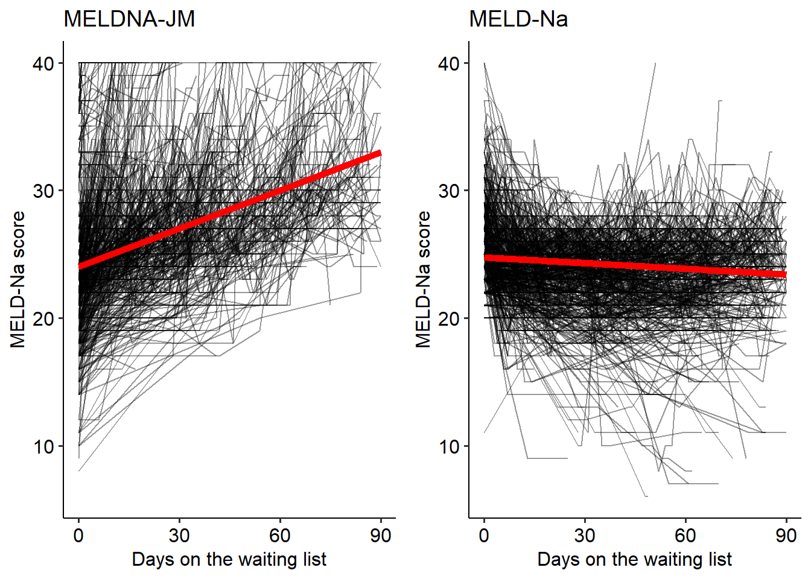

---
output:
  word_document: default
  html_document: default
---
# Part II: Disease over time {.unnumbered}

\chaptermark{Disease over time}

> _It is tempting, if the only tool you have is a hammer, to treat everything as if it were a nail._

> --- Abraham Maslow

------------------------------------------------------------------------

\newpage

# Joint modelling of liver transplant candidates outperforms the model for end-stage liver disease: the effect of disease development over time on patient outcome {#chap-jm}

\chaptermark{Joint Models}

\vspace*{\fill}

\noindent  Goudsmit BFJ, Braat AE, Tushuizen ME, et al. Joint modeling of liver transplant candidates outperforms the model for end-stage liver disease: The effect of disease development over time on patient outcome. _American Journal of Transplantation_. 2021; doi:10.1111/ajt.16730

------------------------------------------------------------------------

\noindent   

**Abstract**

**Background & Aims**: Liver function is measured regularly in liver transplantation (LT) candidates. Currently, these previous disease development data are not used for survival prediction. By constructing and validating joint models (JMs), we aimed to predict outcome based on all available data, using both disease severity and its rate of change over time.

**Methods**: Adult LT candidates listed in Eurotransplant between 2007-2018 (n=16,283) and UNOS between 2016-2019 (n=30,533) were included. Patients with acute liver failure, exception points or priority status were excluded. Longitudinal MELD(-Na) data was modeled using spline-based mixed effects. Waiting list survival was modeled with Cox proportional hazards models. The JMs combined the longitudinal and survival analysis. JM 90-day mortality prediction performance was compared to MELD(-Na) in the validation cohorts.

**Results**: MELD(-Na) score and its rate of change over time significantly influenced patient survival. The JMs significantly outperformed the MELD(-Na) score at baseline and during follow-up. Baseline MELD-JM AUC was 0.94 (0.92-0.95) versus MELD AUC 0.87 (0.85-0.89). MELDNa-JM AUC was 0.91 (0.89-0.93) and MELD-Na AUC was 0.84 (0.81-0.87). The JMs were significantly (p<0.001) more accurate than MELD(-Na). After 90 days, we ranked patients for LT based on their MELD-Na and MELDNa-JM survival rates, showing that MELDNa-JM-prioritized patients had 3x higher waiting list mortality. 

**Conclusion**: The MELD(Na)-JM significantly outperformed current models that drive liver allocation. Thus, patient survival can be dynamically predicted based on past and current disease. These predictions could more accurately direct treatment to those most in need.

\newpage

## Introduction {.unnumbered}
The shortage of available donor livers creates waiting lists of liver transplant (LT) candidates with end-stage liver disease.^1^ In many countries, candidates with the lowest expected survival are ranked highest and thus usually treated first.^2^ In the Eurotransplant and United Network for Organ Sharing (UNOS) regions, the survival prediction and subsequent ranking of LT candidates is based on the Model for End-stage Liver Disease (MELD) or MELD sodium (MELD-Na) score.^2^ The MELD(-Na) score estimates 90-day mortality based on the last known measurement of serum creatinine, bilirubin and the INR (and sodium).^3–5^ For patients awaiting LT, MELD(-Na) scores are repeatedly and regularly measured. These data are valuable for outcome prediction as they show the patient-specific disease development over time.^6,7^ Clinically, it also makes sense to account for past disease and its severity when estimating prognosis. However, currently only the last available MELD(-Na) measurement is used for survival prediction and subsequent LT allocation. Previous data is ignored. 

Joint models (JMs) are a recent statistical development that join longitudinal and survival analysis.^8^ JMs can handle complex follow-up data, i.e. irregularity in number, interval and missing of measurements.^9^ Also, JMs can use both the disease severity and its rate of change for survival prediction. This approximates disease as a dynamic process, whereas MELD(-Na) is static and underestimates fast-changing disease severity.^10,11^ Previous work has shown that JMs can outperform Cox models.^12–14^ JMs have however never been used to model patients with end-stage liver disease or any other large cohort data. The LT setting is interesting for evaluating JMs because statistical models, i.e. currently the MELD(-Na) score, determine who is offered transplantation first. 

The goal of this study is to use joint models to improve prediction of waiting list mortality, by considering disease severity and its rate of change over time. Therefore, this study develops and validates JMs for LT waiting list survival prediction based on repeated MELD(-Na) measurements. We constructed and validated JMs both in the Eurotransplant and the United Network for Organ Sharing (UNOS) regions. Online survival prediction tools of the resulting MELD-JM and MELDNa-JM were created to allow predictions based on single-patient data.

## Methods {.unnumbered}
The analyses were done separately for the Eurotransplant and UNOS regions, MELD- and MELD-Na based JMs were constructed and validated respectively. 

### Study population {.unnumbered}
For this study, waiting list data was used from Eurotransplant and the UNOS regions. For the Eurotransplant region, patients were followed between January 1^st, 2007 until December 31^st, 2018. For the UNOS, the study interval was from January 16^th 2016 (MELD-Na implementation) to December 31^st, 2019. Patients with acute liver failure, exception points or priority status at registration and listing for multiple organs were excluded. All other adult patients listed for a first LT were included. Longitudinal exception points were not modeled, as they do not reflect disease severity within the patient. Separate training (67% of the patients) and testing (33%) sets were constructed through random sampling. The longitudinal data of the waiting list contained repeated measurements of the MELD(-Na) score.^4 Data from first active listing until delisting were used. Reasons for delisting were death, transplantation, removal or the end of study. Patients who were removed due to deteriorating clinical condition or who died within 30 days of removal were also counted as deceased. “Removal” comprised of removal from the waiting list due to improved clinical condition and censoring for exception points or priority status acquired during follow-up. The primary outcome of survival analysis was the overall waiting list mortality. Predictors were (repeated) MELD(-Na) scores. In table S7, results are shown of an additional model that also considers e.g. age, region and sex. For the longitudinal analysis, patients were censored at the end of the study follow-up. Also, patients receiving priority status or exception points during waiting were censored from that date, as transplant and thus death chances would change from that time point on. The sample size was set by the retrospective study design. Complete-case analysis was done.

### Statistical analysis {.unnumbered}
Study variables following normal distributions are presented as mean±SD (standard deviation) and non-normal variables as median±IQR (interquartile range). Categorical variables are reported as counts and percentages.

### Longitudinal analysis {.unnumbered}
The longitudinal MELD(-Na) data were modeled with mixed effect models. These calculate both the average (population) and individual (deviation of each patient from the average) MELD(-Na) development over time. Importantly, they model developments as continuous trajectories, which can also be non-linear, e.g. hyperbolical. This gives a natural approximation of disease over time, which contrasts the last measurement carried-on-forward approach of Cox models (figure S4). The fixed effects included: intercept (representation of disease severity at baseline) and time on the waiting list which were modeled with natural cubic splines (3 degrees of freedom). The random effect components, which varied to randomly deviate from the average for each individual, were intercept (baseline disease severity) and follow-up time on the waiting list. 

### Combining longitudinal and survival analysis {.unnumbered}
Next, the abovementioned mixed effects model was combined with a Cox model. The latter was fit to the outcome of waiting list mortality, censoring for all other outcomes, with MELD(-Na) as predictor. Thus, the MELD(-Na) joint models (MELD-JM and MELDNa-JM) were constructed using the R package “JMbayes”.^15^ The JMs predicted survival using both the value of the MELD(-Na) score and its rate of change at each moment in time (i.e. time-dependent slope). By considering time-dependent slopes, a more nuanced definition of disease severity is used for survival prediction, see Figure \@ref(fig:jm-fig1). Also, predictions are updated for each newly-available measurement, i.e. the model is dynamic.

```{r jm-fig1, echo=F, fig.cap='Two hypothetical patient trajectories on the LT waiting list are shown. Patient A initially increases and then stabilizes in disease severity. B is initially stable and later deteriorates. Under the current MELD(-Na) allocation, patient A would be prioritized over patient B in liver allocation, because the most recent MELD(-Na) is used. However, the JM uses both the past and current disease severity (value) and the rate of change at each moment in time (slope). At any given time, the JM combines the hazard ratio’s for value and slope to calculate the risk of death. Thus, the JM would calculate a higher mortality risk and thus LT priority for patient B, because the disease is increasing fast.', dpi=1500, out.width="100%"}
knitr::include_graphics("figures/jm/figure 1.png" , auto_pdf=T)
```

### Prediction performance {.unnumbered}
The JMs ability to predict 90-day mortality was assessed by calculating the area under the receiver operator curve (AUC) and prediction errors (Brier scores). Model performance was assessed at baseline (start of waiting list follow-up) and 3-monthly during follow-up of two years through bootstrap cross validation with 100 repetitions. To clarify, patients were censored if they did not die, but their data up until censoring would still be used when calculating performance. For comparison to currently-used models, MELD(-Na) prediction performance was also calculated at these time points. 

### Impact on the waiting list {.unnumbered}
Next, we estimated the possible impact of using the JMs instead of MELD(-Na) for waiting list prioritization. To do this, data from baseline to 90 days was used. At day 90, patients still on the waiting list were ranked highest-to-lowest based on their predicted 90-day mortality probability. This created a different ranking for the MELD(Na)-JM and MELD(-Na) models. The number of available donor livers in the first 90 days was then assigned to the highest ranking patients. This created a rough estimate who would have been offered LT first.^16,17^ To further explain the possible differences in prioritization, baseline characteristics and the MELD(-Na) developments over time were compared between patients prioritized either by the MELD(Na)-JM or MELD(-Na). 

### Online LT-JM prediction tool {.unnumbered}
Lastly, online prediction tools of the MELD-JM (https://predictionmodels.shinyapps.io/meld-jm/) and MELDNa-JM (https://predictionmodels.shinyapps.io/MELDNa-JM/) were created. This allows interested readers to predict survival probabilities based on individual patient data. For the instruction manual, see supplement page 3. All the analyses were done with R v4.0.0 (R Foundation for Statistical Computing, Vienna, Austria).

## Results {.unnumbered}

### Population characteristics {.unnumbered}
Table \@ref(tab:jm-tab1) shows the baseline characteristics for the Eurotransplant and UNOS populations. The 16,283 Eurotransplant LT candidates had a median age of 55 (48-61) at listing. Most (66.3%) patients were male and the most common liver diseases were (post)alcoholic (39.5%), cholestatic (11.7%) and hepatitis-C (10.7%) induced cirrhosis. At the end of follow-up, 50.2% were transplanted, 20.9% deceased, 20.2% were removed either due to improved clinical condition, priority status or exception points and 8.7% were censored at the end of study. The 30,533 UNOS patients had a median age of 58 (50-64) years and were mostly (63.3%) male. Alcohol- (30.5%) and NASH (20.7%) related liver cirrhosis were most common. The median MELD at listing was 18 (13-26), which was higher than the MELD 15 (11-21) for the Eurotransplant region. Median MELD-Na at listing was 19 (12-27) points in the UNOS cohort. At the end of follow-up, 52.2% was transplanted, 13% had died while waiting or was removed because of worsening clinical condition 31% was removed due to improved condition, exception point or status 1 approval during follow-up and 3.8% was censored at the end of study.

```{r jm-tab1,message=FALSE, echo=F}
options(warn=-1)
library(kableExtra)
library(readxl)
library(tidyverse)
tab1 <- read_excel("figures/jm/table 1.xlsx")
options(knitr.kable.NA = '')
kbl(tab1,booktabs=T, caption = "Baseline characteristics for the Eurotransplant and UNOS regions",
    linesep= "")%>%
  kable_styling(latex_options = c("striped")) %>%
  kable_classic() %>%
  pack_rows("Disease (%)", 6, 11) %>%
  pack_rows("Serum measurement at listing (mean (SD))", 12, 15) %>%
  pack_rows("Status at delisting (%)", 19, 22) %>%
  footnote(threeparttable=T, general = "NA: Eurotransplant has no complete data regarding this item, HCV: hepatitis-C induced, HCC: hepatocellular carcinoma,HU: high urgent status, NSE: (non)standard exception points, MELD: Model of End-stage Liver Disease")

options(warn=0)
``` 

### JM properties {.unnumbered}
The JMs calculates hazard ratios at a specific time (HRt) though the following equations, for MELD-JM: $${HR}_t=\left({1.29}^{{MELD}_{value}}\right)\ast({8.12}^{{MELD}_{slope}})$$ and MELDNa-JM: $${HR}_t=\left({1.24}^{{MELDNa}_{value}}\right)\ast\left({8.02}^{{MELDNa}_{slope}}\right)$$ The MELD-JM coefficient for MELD values is 1.29 with 95% CI (1.28-1.31). The MELD-JM slope coefficient is 8.12 (95% CI 1.27-50.38). For the MELDNa-JM these are 1.23 (95% CI 1.24-1.26) and 8.02 (95% CI 3.65-17.1) respectively. This means that at a given moment in time, a 1-point increase in MELD value will increase mortality risk by a factor 1.29, and a 1-point faster or slower change gives a factor 8.12 difference. These equations, combined with the baseline risks, can be used to calculate specific risks. However, the JM is needed to calculate the MELD(-Na) value and slope at a given time point. To enable easy access to JM predictions, we developed online applications of the MELD-JM (https://predictionmodels.shinyapps.io/meld-jm/) and MELDNa-JM (https://predictionmodels.shinyapps.io/MELDNa-JM/). Interested readers can upload repeated MELD(-Na) measurements of individual patients into these applications, to generate personalized predictions. See supplement page 3 for an instruction manual. The performance of these JMs is tested below.

### JM performance {.unnumbered}
The JM performance was assessed in the independent validation data at baseline (Figure \@ref(fig:jm-fig2) and figure S1) and during follow-up (Table \@ref(tab:jm-tab2): UNOS, table S1: Eurotransplant). 

```{r jm-fig2, echo=F,fig.ncol=1,fig.subcap=c('90-day mortality ROC plot of the MELDNa-JM and MELD-Na.', 'Calibration plot of the MELDNa-JM and MELD-Na score. Each dot represents 10 percent of the population. The lines show how well the predicted risks match the observed risks'), fig.cap='Performance measures for the MELDNa-JM and MELD-Na.'}
knitr::include_graphics(c("figures/figure-html/jm-fig2-1.png",
                          "figures/figure-html/jm-fig2-2.png"))
``` 

```{r jm-tab2,message=FALSE, echo=F}
options(warn=-1)
library(kableExtra)
library(readxl)
library(tidyverse)
tab1 <- read_excel("figures/jm/table 2.xlsx")
colnames(tab1) <- c("Time (months)","AUC","low95","upp95","AUC","low95","upp95","p")
kbl(tab1,booktabs=T, caption = "90-day mortality AUCs of the MELDNa-JM versus the MELD-Na, at baseline and during waiting list follow-up in the validation cohort.",
    linesep= "")%>%
  kable_styling(latex_options = c("striped")) %>%
  add_header_above(c(" " = 1, "MELDNa-JM" = 3, "MELD-Na" = 3," " = 1)) %>% 
  kable_classic() %>%
  footnote(threeparttable=T, general = "AUC: area under receiver operator curve, JM: joint model, MELD-Na: model for end-stage liver disease sodium score")

options(warn=0)
``` 

At baseline, MELDNa-JM AUC was 0.91 (0.89-0.93) and MELD-Na AUC was 0.84 (0.81-0.87). In Eurotransplant, MELD-JM AUC was 0.94 (95% CI 0.92-0.95) compared to 0.87 (0.85-0.89) for MELD (figures S1 and S2). For both the MELD(Na)-JM and MELD(-Na), prediction performance was best in the first months of follow-up. The MELD(Na)-JMs AUCs were significantly (p<0.001) better than the MELD(-Na) for the first 12 months of follow-up. During this period, the majority of transplantations was done, i.e. 94% (UNOS) and 84% (Eurotransplant). After 12 months, JMs AUCs were still notably but not significantly better than MELD(-Na). Over time, MELD(-Na) might be less representative of disease severity in LT candidates, which could explain the decrease in AUC over time for both models. MELD(Na)-JM prediction errors were always significantly lower than the MELD(-Na) (figure 2B, figure S2, tables S1 and S2). In other words, the JMs predictions were more accurate and thus better resembled the observed risks in the population. Subset analysis of prior (2007-2012) versus recent (2013-2018) years showed slightly better performance in the 2007-2012 cohort (table S4). Excluding HCV patients as sensitivity analysis increased AUCs (table S5). MELDNa-JM performed better in males (Figure S5), possibly because MELD-Na tends to underestimate female disease severity through lower creatinine levels.18 Performance was comparable for most diseases and worst in HCV disease (Figure S6). The implications for LT candidates might be limited, as the number of listed HCV patients is decreasing.19 Performance for non-black candidates was slightly better than for black candidates (Figure S7).

### JM impact on the waiting list {.unnumbered}
The possible differences in MELDNa-JM and MELD-Na prioritization were assessed. Table \@ref(tab:jm-tab3) shows the baseline characteristics of patients that would have been prioritized both by MELDNa-JM and MELD-Na, by one of the models or by neither (table S6: MELD and MELD-JM comparison). 
```{r jm-tab3,message=FALSE, echo=F}
options(warn=-1)
library(kableExtra)
library(readxl)
library(tidyverse)
tab1 <- read_excel("figures/jm/table 3.xlsx")
options(knitr.kable.NA = '')
kbl(tab1,booktabs=T, caption = "90-day mortality AUCs of the MELDNa-JM versus the MELD-Na, at baseline and during waiting list follow-up in the validation cohort.",
    linesep= "")%>%
  kable_styling(latex_options = c("scale_down","striped")) %>%
  pack_rows("Disease (%)", 6, 13) %>%
  kable_classic() %>%
   #kable_styling(latex_options = c("scale_down")) %>% 
landscape()
``` 
Compared to MELD-Na, the MELDNa-JM prioritized slightly younger (56 vs 58 years) and female (46.5% vs 35.4%) patients, who less often had hepatitis-C-induced liver cirrhosis. Most importantly, MELDNa-JM-prioritized patients had a 3.6 times higher 90-day mortality rate, i.e. 15.4% versus 4.3%. For the Eurotransplant region, MELD-JM prioritized patients with 5.0 times higher 90-day mortality compared to MELD, i.e. 23.2% versus 4.6% (table S6). A possible cause of this difference in mortality is illustrated in Figure \@ref(fig:jm-fig3). 

```{r jm-fig3,message=F, warn=F, echo=F, fig.cap='The MELDNa- JM and MELD- Na would prioritize different patients for liver transplantation. For these patients, we plotted the individual (black lines) and average (red line) MELD-Na score development during 90 days. Although the MELD-Na-prioritized patients had a higher initial MELD-Na score (value), their average scores remained stable (slope). In contrast, the JM-prioritized patients had lower MELD-Na (value) scores but with faster increasing disease severity (slope). Interestingly, the JM- prioritized patients had a five times higher 90- day mortality rate. Indicating that JM prioritization could possibly be more just.'}

```


The JM prioritized patients with lower median MELD-Na scores, see Table \@ref(tab:jm-tab3), but these patients had increasing disease severity at the time of liver graft allocation. This illustrates how not only the MELD-Na value, but also the rate of change is considered when estimating survival (figure S3 for Eurotransplant plots). The MELDNa-JM could therefore have prioritized patients with a higher waiting list mortality, possibly not captured by MELD-Na. 

### Online prediction tools {.unnumbered}
To access MELD-JM or MELDNa-JM predictions for the individual patient, please visit respectively https://predictionmodels.shinyapps.io/meld-jm/ or https://predictionmodels.shinyapps.io/MELDNa-JM/. See page 3 of the supplement for instructions. For clinical JM implementation in individual patients, repeated measurements of MELD(-Na) can be loaded into the online app. This essentially is the same data as uploaded to organ procurement organizations. The JM app then calculates prognosis based on these measurements and lets the user choose the moment in time and prediction horizon, e.g. assess 90-day survival probabilities after five months of waiting. These individual predictions can improve clinical decision making.

## Discussion {.unnumbered}
This retrospective cohort analysis aimed to improve LT candidate survival prediction by using longitudinal data. Therefore, we developed and validated the MELD-JM and MELDNa-JM for waiting list mortality prediction in the Eurotransplant and UNOS regions. We report several important findings. First, the JM-calculated MELD(-Na) values and their time-dependent rate of change are significantly associated with LT candidate waiting list mortality. Second, using time-dependent value and slope, the JMs significantly outperformed both MELD and MELD-Na when predicting mortality. Third, the JMs would have prioritized patients with three to five times higher mortality on the waiting list, who would not have been prioritized under MELD(-Na). 

### Longitudinal analysis {.unnumbered}
The progression of liver disease changes within and between patients over time. The current models that determine transplantation priority for patients with end-stage liver disease, i.e. the MELD(-Na), ignore previous disease development. However, for the clinician it is evident that the history of disease is important when estimating prognosis. Therefore, JMs were used to combine longitudinal and survival analysis.^8^ The resulting MELD(Na)-JM estimate both the value and slope - i.e. current disease severity and the current rate of change- at each new measurement in time to predict survival, while also considering all previous measurements, see Figure \@ref(fig:jm-fig1). The resulting disease developments are a continuous and flexible trajectory over time, whereas e.g. time-dependent Cox (TDC) models carry the last measured value on forward.^20^ This can fail to adequately model changing disease severity (figure S4) and can lead to underestimation of mortality in severely-ill LT candidates.^11^ The idea of using MELD(-Na) rate of change for survival prediction is not new. Previously, the MELD spike and delta-MELD have been proposed.^6,21^ The MELD spike indicates a 30% or higher difference between current MELD and the MELD score measured 7 days ago. It is a binary parameter based on cut-offs (30% and 7 days). However, through joint-modelling, we achieved a continuous representation of disease based on all data (not only assessing 30% differences or the past 7 days). MELD spike was intended as tiebreaker between patients with the same MELD scores. The JMs could however prioritize patients even if their MELD-Na values are lower, as long as the product of the value and slope is higher, see Figure \@ref(fig:jm-fig1) and \@ref(fig:jm-fig3). The delta-MELD is the difference between lowest MELD in previous 30 days and current MELD. It averages the slope over a varying number of previous days or measurements (depending on the date of lowest MELD). In our view, this makes it an imprecise approximation of current rate of change. Still, it is often considered as predictor in LT analysis.^22–26^ However, Bambha et al. already showed that the effect of delta-MELD depends on the frequency of measurements.^27^ In contrast, the estimated slope of the MELD(Na)-JM is updated with each new measurement and is not altered by the frequency of measurements. 

### Prediction performance {.unnumbered}
The MELD(Na)-JM prediction performance was significantly better than MELD(-Na). The predictions also more accurately resembled the actual survival rates on the waiting list. Models on which treatment decisions are based should ascertain excellent accuracy.^28^ Using additional predictors in JMs, such as age and sex, slightly improved AUCs after 12 months (table S7). However, this was a small improvement, while using these predictors adds to complexity and might be considered unethical. Therefore, MELD(-Na)-only JMs were primarily constructed. Others have also studied possible improvements to MELD(-Na). Recently, a machine-learning MELD-Na alternative was constructed by Bertsimas et al., i.e. the optimized prediction of mortality (OPOM) model.^29^ Although OPOM outperformed MELD-Na, it also considered more (n=25 or 28) variables. Moreover, OPOM is based on classification analysis, i.e. is the patient alive after 90 days yes/no, instead of survival analysis, i.e. how much time passed until death or censoring. Other machine-learning techniques, like random survival forests and neural networks, do not seem to outperform Cox models, even in high-dimensional data.^30^ Previous work did show that JMs outperform time-dependent Cox (TDC) models,^12–14^ which is interesting considering the frequent use of TDC analysis for LT candidates.^6,7,24,27,31–33^ We believe that the TDC last measurement carried-on-forward can give a suboptimal representation of disease (supplement figure 4). With changing disease severity, the TDC model either underestimates or overestimates disease severity. This is especially the case if few measurements are available or data is missing, which often occurs in LT candidate data. 

### Impact on the waiting list {.unnumbered}
We investigated the prioritization differences between the MELDNa-JM and MELD-Na, to give clinical meaning to the found statistical improvements. Considering the rate of change in disease severity helped to identify patients with worse prognosis, which illustrates the concepts shown in Figure \@ref(fig:jm-fig1). To optimize the sickest-first allocation and transplantation benefit, it could therefore be interesting to use the JM-approximated course of disease for LT evaluation. Physicians can use the MELD(Na)-JM as online tool (see above) to predict outcome based on individual patient data. Also, on a center or waiting list population level, JMs can be applied to predict survival of each eligible patient every time a donor liver graft is offered. These predictions can be used alongside or eventually perhaps instead of MELD(-Na), because JM performance is good compared to MELD-Na and the same data is used. This is practical, because no changes would have to be made in the centers’ routine of collecting and uploading data.

### Limitations {.unnumbered}
A limitation is that data could be missing dependent on unobserved values. Statistical methods, like the JM and Cox model, assume missing at random (MAR) data. For the waiting list, this means that MELD(-Na) missingness should not depend on unobserved values, but it may depend on observed values. Because unobserved values cannot be observed, MAR cannot be proven in this study or any other Eurotransplant/UNOS registry analysis. We did however assess the relation between MELD(-Na) value and reporting frequency (supplement “missingness analysis”). Involuntary updates of low MELD(-Na) scores were done in only a small part of the data. Also, despite the fact that the most recent score was lower than the previous one, centers still reported these values and often well in time. The average time between measurements that were previously higher or lower did not differ substantially. Dependent missingness in low MELD(-Na) scores could lead to overestimation of waiting list mortality. A solution to alleviate possible bias could be to increase the mandatory update frequency of MELD(-Na) scores. Another limitation is that patients with exception points were excluded, because longitudinal modelling of arbitrarily assigned MELD points does not reflect disease severity. However, JMs could be used to model repeated AFP measurements, tumor characteristics and response to therapy. Also, the difference in waiting list prioritization between the MELD(-Na) and MELD(Na)-JM is a rough estimate, which depends on the chosen interval, i.e. for a shorter follow-up, presumably prioritization of the two indices would be more similar and vice versa. Furthermore, we did not study postoperative survival if the MELD(Na)-JM would have been used for allocation. This is because the JMs were not used to drive allocation. We therefore only could have assessed postoperative survival after MELD(-Na) allocation and would not know how the JMs would have changed that. These questions concern counterfactual outcomes in causal inference, e.g. what would have happened to patients had they not been transplanted.^34^ The best way to evaluate a new allocation system is to bring it in practice and measure the difference. Evaluating a new allocation system through simulation is probably the next best option. These extensive simulations were beyond the scope of this study. One should be aware, however, that assessment through simulation is based on intrinsically unverifiable assumptions, namely that with changing the allocation priorities nothing else in the system will change. Lastly, JMs are statistically complex and can give biased results if mis-specified. Therefore, construction should be done with care. To aid clinicians, we made online versions of our models freely available.

## Conclusion {.unnumbered}
This study developed and validated the MELD-JM and MELDNa-JM prediction models for respectively the Eurotransplant and UNOS regions. The MELD(Na)-JM significantly outperformed current models that drive liver allocation. Thus, patient survival can be dynamically predicted based on past and current disease. These predictions could more accurately direct treatment to those most in need.

\newpage

## References {.unnumbered}
1. 	Eurotransplant. Annual Report 2017.; 2018. www.eurotransplant.org.
2. 	Tschuor C, Ferrarese A, Kuemmerli C, et al. Allocation of liver grafts worldwide – Is there a best system? J Hepatol. 2019;71(4):707-718. doi:10.1016/j.jhep.2019.05.025
3. 	Malinchoc M, Kamath PS, Gordon FD, Peine CJ, Rank J, Ter Borg PCJ. A model to predict poor survival in patients undergoing transjugular intrahepatic portosystemic shunts. Hepatology. 2000;31(4):864-871. doi:10.1053/he.2000.5852
4. 	Wiesner R, Edwards E, Freeman R, et al. Model for end-stage liver disease (MELD) and allocation of donor livers. Gastroenterology. 2003;124(1):91-96. doi:10.1053/gast.2003.50016
5. 	Kim WR, Biggins SW, Kremers WK, et al. Hyponatremia and Mortality among Patients on the Liver-Transplant Waiting List. N Engl J Med. 2008;359(10):1018-1026. doi:10.1007/s11250-017-1262-3
6. 	Merion RM, Wolfe RA, Dykstra DM, Leichtman AB, Gillespie B, Held PJ. Longitudinal assessment of mortality risk among candidates for liver transplantation. Liver Transplant. 2003;9(1):12-18. doi:10.1053/jlts.2003.50009
7. 	Sharma P, Schaubel DE, Sima CS, Merion RM, Lok ASF. Re-weighting the Model for End-Stage Liver Disease Score Components. Gastroenterology. 2008;135(5):1575-1581. doi:10.1053/j.gastro.2008.08.004
8. 	Rizopoulos R. Joint Models for Longitudinal and Time-to-Event Data: With Applications in R. 1st ed. Chapman and Hall/CRC; 2012.
9. 	Papageorgiou G, Mauff K, Tomer A, Rizopoulos D. An Overview of Joint Modeling of Time-to-Event and Longitudinal Outcomes. Annu Rev Stat Its Appl. 2019;6(1):223-240. doi:10.1146/annurev-statistics-030718-105048
10. Goudsmit BFJ, Tushuizen ME, Putter H, Braat AE, van Hoek B. The role of the model for end-stage liver disease-sodium score and joint models for 90-day mortality prediction in patients with acute-on-chronic liver failure. J Hepatol. 2021;74(2):475-476. doi:10.1016/j.jhep.2020.08.032
11. Hernaez R, Liu Y, Kramer JR, Rana A, El-serag HB, Kanwal F. Model for end-stage liver disease-sodium underestimates 90-day mortality risk in patients with acute-on-chronic liver failuare. J Hepatol. 2020. doi:10.1016/j.jhep.2020.06.005
12. Arisido MW, Antolini L, Bernasconi DP, Valsecchi MG, Rebora P. Joint model robustness compared with the time-varying covariate Cox model to evaluate the association between a longitudinal marker and a time-to-event endpoint. BMC Med Res Methodol. 2019;19(1):1-13. doi:10.1186/s12874-019-0873-y
13. Rizopoulos D, Takkenberg JJM. Tools & techniques - Statistics: Dealing with time-varying covariates in survival analysis - joint models versus Cox models. EuroIntervention. 2014;10(2):285-288. doi:10.4244/EIJV10I2A47
14. Campbell KR, Juarez-Colunga E, Grunwald GK, Cooper J, Davis S, Gralla J. Comparison of a time-varying covariate model and a joint model of time-to-event outcomes in the presence of measurement error and interval censoring: Application to kidney transplantation. BMC Med Res Methodol. 2019;19(1):1-12. doi:10.1186/s12874-019-0773-1
15. Rizopoulos D. The R package jmbayes for fitting joint models for longitudinal and time-to-event data using MCMC. J Stat Softw. 2016;72(7). doi:10.18637/jss.v072.i07
16. Goudsmit BFJ, Putter H, Tushuizen ME, et al. Refitting the model for end-stage liver disease for the Eurotransplant region. Hepatology. 2020;in press.
17. Leise MD, Kim WR, Kremers WK, Larson JJ, Benson JT, Therneau TM. A revised model for end-stage liver disease optimizes prediction of mortality among patients awaiting liver transplantation. Gastroenterology. 2011;140(7):1952-1960. doi:10.1053/j.gastro.2011.02.017
18. Myers RP, Shaheen AAM, Aspinall AI, Quinn RR, Burak KW. Gender, renal function, and outcomes on the liver transplant waiting list: Assessment of revised MELD including estimated glomerular filtration rate. J Hepatol. 2011;54(3):462-470. doi:10.1016/j.jhep.2010.07.015
19. Kwong AJ, Kim WR, Lake JR, et al. OPTN/SRTR 2019 Annual Data Report: Liver. Am J Transplant. 2021;21(S2):208-315. doi:10.1111/ajt.16494
20. Dekker FW, De Mutsert R, Van Dijk PC, Zoccali C, Jager KJ. Survival analysis: Time-dependent effects and time-varying risk factors. Kidney Int. 2008;74(8):994-997. doi:10.1038/ki.2008.328
21. Massie AB, Luo X, Alejo JL, Poon AK, Cameron AM, Segev DL. Higher Mortality in Registrants With Sudden Model for End-Stage Liver Disease Increase: Disadvantaged by the Current Allocation Policy. Liver Transplant. 2015;21(5):683-689. doi:10.1002/lt
22. Belli LS, Berenguer M, Cortesi PA, et al. Delisting of liver transplant candidates with chronic hepatitis C after viral eradication: A European study. J Hepatol. 2016;65(3):524-531. doi:10.1016/j.jhep.2016.05.010
23. Cholankeril G, Li AA, Dennis BB, et al. Pre-Operative Delta-MELD is an Independent Predictor of Higher Mortality following Liver Transplantation. Sci Rep. 2019;9(1):8312. doi:10.1038/s41598-019-44814-y
24. Györi GP, Silberhumer GR, Rahmel A, et al. Impact of dynamic changes in MELD score on survival after liver transplantation – a Eurotransplant registry analysis. Liver Int. 2016;36(7):1011-1017. doi:10.1111/liv.13075
25. Schlegel A, Linecker M, Kron P, et al. Risk Assessment in High- and Low-MELD Liver Transplantation. Am J Transplant. 2017;17(4):1050-1063. doi:10.1111/ajt.14065
26. Northup PG, Berg CL. Preoperative delta-MELD score does not independently predict mortality after liver transplantation. Am J Transplant. 2004;4(10):1643-1649. doi:10.1111/j.1600-6143.2004.00593.x
27. Bambha K, Kim WR, Kremers WK, et al. Predicting survival among patients listed for liver transplantation: An assessment of serial MELD measurements. Am J Transplant. 2004;4(11):1798-1804. doi:10.1111/j.1600-6143.2004.00550.x
28. Van Calster B, McLernon DJ, Van Smeden M, et al. Calibration: The Achilles heel of predictive analytics. BMC Med. 2019;17(1):1-7. doi:10.1186/s12916-019-1466-7
29. Bertsimas D, Kung J, Trichakis N, Wang Y, Hirose R, Vagefi PA. Development and validation of an optimized prediction of mortality for candidates awaiting liver transplantation. Am J Transplant. 2019;19(4):1109-1118. doi:10.1111/ajt.15172
30. Kantidakis G, Putter H, Lancia C, Boer JD, Braat A, Fiocco M. Survival prediction models since liver transplantation - comparisons between Cox models and machine learning techniques. BMC Med Res Methodol. 2020;20(277):1-14. doi:10.21203/rs.3.rs-22670/v1.
31. Luo X, Leanza J, Massie AB, et al. MELD as a metric for survival benefit of liver transplantation. Am J Transplant. 2018;18(5):1231-1237. doi:10.1111/ajt.14660
32. Schaubel DE, Guidinger MK, Biggins SW, et al. Survival benefit-based deceased-donor liver allocation. Am J Transplant. 2009;9(4 PART 2):970-981. doi:10.1111/j.1600-6143.2009.02571.x
33. Sharma P, Schaubel DE, Gong Q, Guidinger M, Merion RM. End-stage liver disease candidates at the highest model for end-stage liver disease scores have higher wait-list mortality than status-1A candidates. Hepatology. 2012;55(1):192-198. doi:10.1002/hep.24632
34. van Geloven N, Swanson SA, Ramspek CL, et al. Prediction meets causal inference: the role of treatment in clinical prediction models. Eur J Epidemiol. 2020;35(7):619-630. doi:10.1007/s10654-020-00636-1