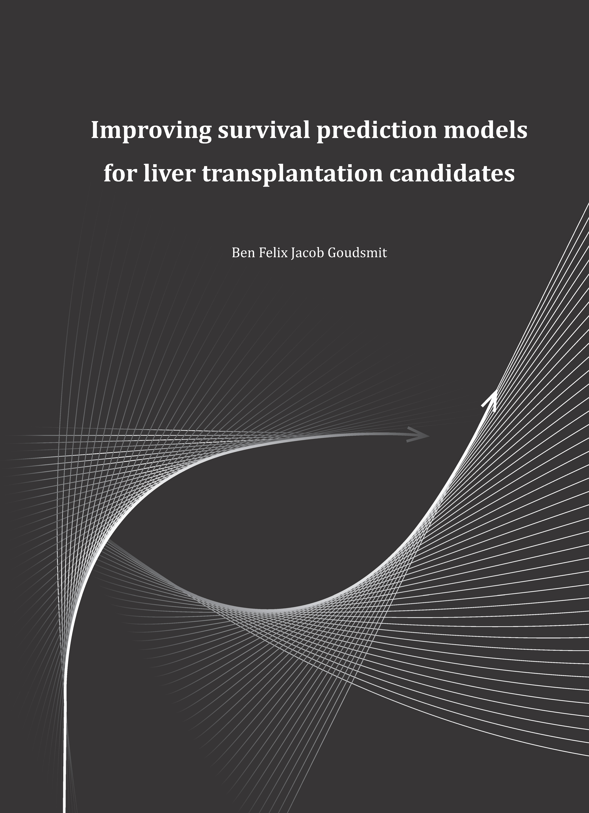

# Preface {-}

```{r align='center',  dpi=300 ,echo=FALSE, include = knitr::is_html_output()}
 # show thesis cover
```

---

* This thesis was constructed under the supervision of prof. dr. [Bart van Hoek](https://www.lumc.nl/org/mdl/medewerkers/90331020340185), prof. [Hein Putter](https://www.lumc.nl/org/bds/medewerkers/hputter), and dr. [Andries E. Braat](https://www.lumc.nl/org/heelkunde/medewerkers/90126035349185).

* The research was conducted at the [Leiden University Medical Center](https://www.lumc.nl/) and the [Eurotransplant International Foundation](https://www.eurotransplant.org/).


```{=html}
<p><a rel="license" href="http://creativecommons.org/licenses/by/4.0/"></a><br />The online version of this thesis is licensed under a <a rel="license" href="http://creativecommons.org/licenses/by/4.0/">Creative Commons Attribution 4.0 International License</a>. The <i class="fa fa-file-pdf-o"></i> pdf version of the thesis is available for download on the toolbar above.</p>
```